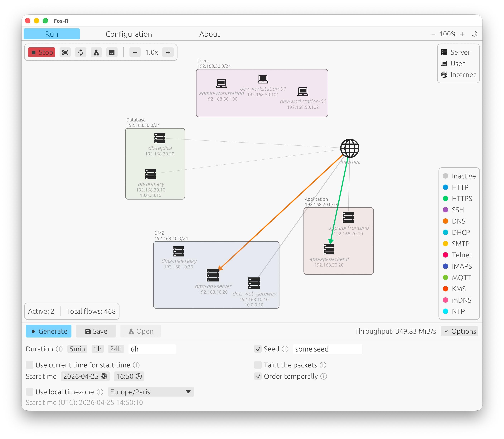
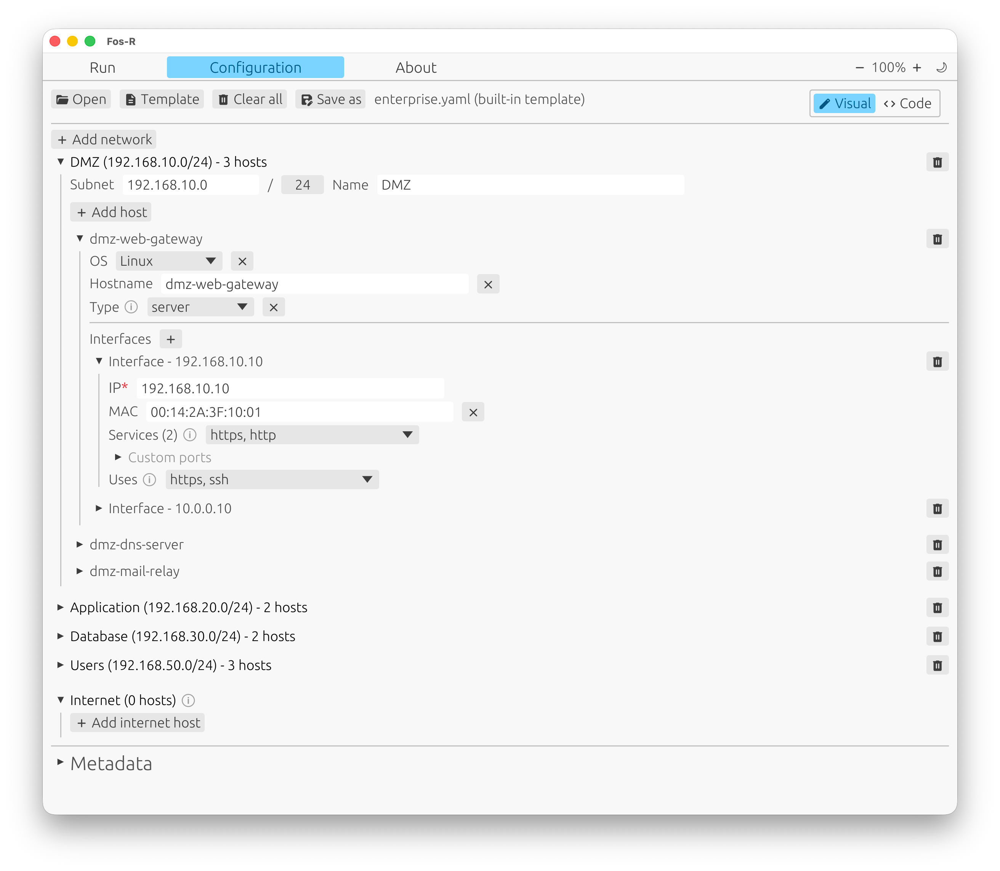

### About me

Final-year student at CentraleSupélec, majoring in Cybersecurity. Currently doing my end-of-studies internship as a Software Engineer at Datadog.

---

### Experience

- **Software Engineer Intern at Datadog** *(current)*
- **Full Stack Developer Intern at padoa** — Angular, Express, PostgreSQL, Vitest, Cypress
- **Backend Engineer Intern at bport** — Python, PostgreSQL, Docker

---

### Projects

#### [Fos-R — GUI for network traffic generation](https://github.com/Fos-R/Fos-R)

I worked on Fos-R as part of an academic project with another student. We built a cross-platform GUI for configuring and visualizing network topologies and generating traffic. I mainly focused on the visualization and traffic generation view, and also contributed to the configuration panel.

- Built in **Rust** with [egui](https://github.com/emilk/egui), cross-platform with **WASM** support for integration into the [Fos-R website](https://fosr.inria.fr).
- Interactive network topology viewer with animated traffic flow simulation between hosts.
- Generation controls to produce synthetic traffic as a PCAP file.
- Configuration panel for defining network hosts, subnets, and services.

#### SaaS solution for the pastry and bakery industry _(private repository)_

I'm building a SaaS solution for the pastry and bakery industry as a learning project, exploring full-stack development and software architecture.

- **Frontend:** Angular with Tailwind CSS.
- **Backend:** NestJS, PostgreSQL, TypeORM.
- **Testing:** Vitest, Playwright.
- **DevOps:** Docker, GitHub Actions CI/CD.
